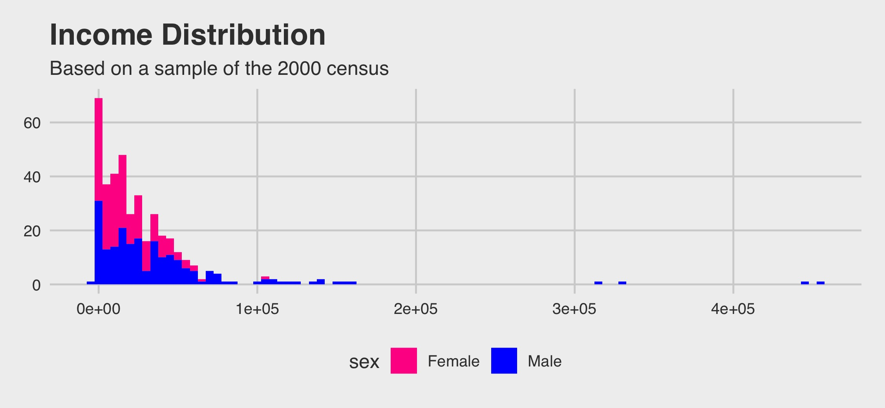

```{r setup, include=FALSE}
knitr::opts_chunk$set(echo = TRUE)
library(openintro)
library(tidyverse)
library(ggthemes)
library(infer)
```

## Final Project

All parts of the *R* final will use the *census* data set from the {OpenIntro} package. The goal of this project is to do a short statistical analysis of income when viewed from a gender perspective. Any *R* packages that might be needed are already included in the *setup* code chunk.

The first task is to calculate the five number summary, standard deviation and variance for the **total_personal_income** variable for all people, men, and women. Your solution should be a data frame with three rows and eight columns - the seven values you calculate plus gender.

```{r task_one}
#INSERT YOUR CODE HERE
```


Your second task is to replicate the plot below. (HINT: It does use one of the themes from the ggthemes package.)



```{r task_two}
#Insert Your Code Here
```

Your final task is to conduct a **two-sample t-test** to determine if there is a difference in pay (total\_personal\_income) between males and females. Note that your test should include a written conclusion in statistical and practical terms. 

```{r task_three}
#Insert Your Code Here
```
