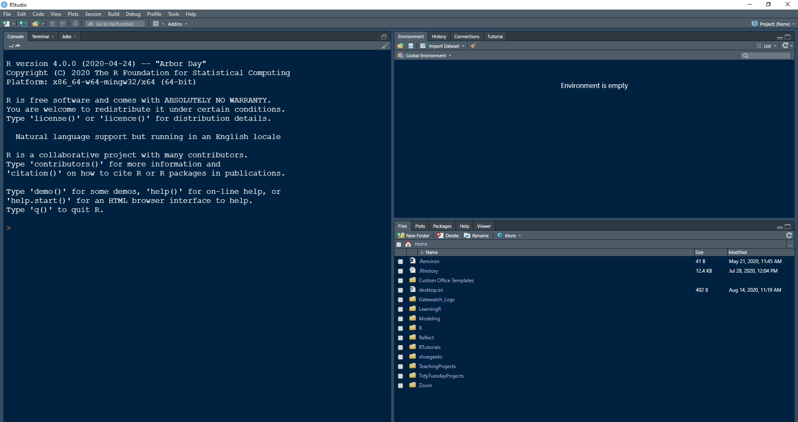
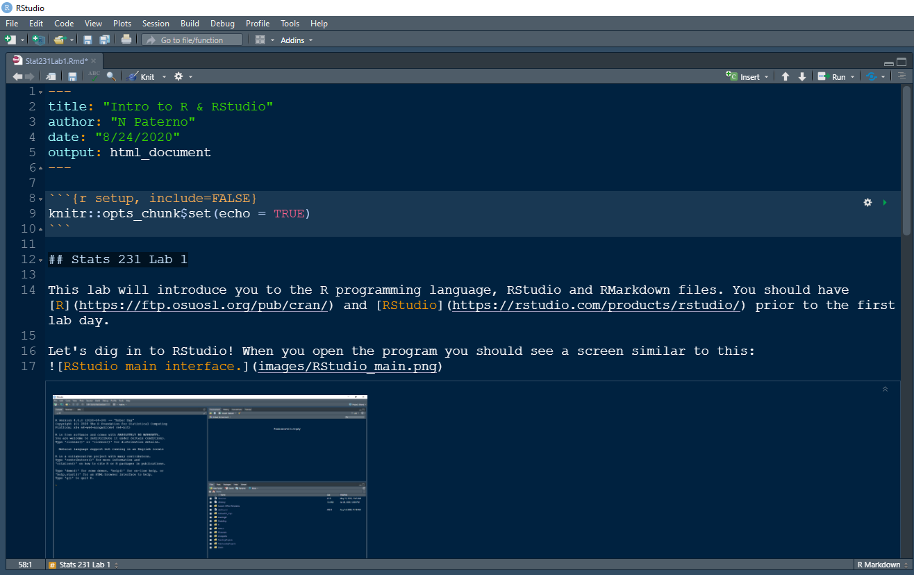
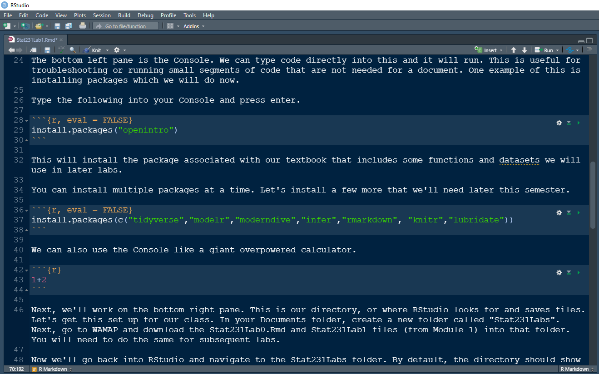

```{r setup, include=FALSE}
knitr::opts_chunk$set(echo = TRUE)
```

## R and RStudio

This lab will introduce you to the R programming language, RStudio and RMarkdown files. You should have [R](https://ftp.osuosl.org/pub/cran/) and [RStudio](https://rstudio.com/products/rstudio/) prior to the first lab day.

Let's dig in to RStudio! When you open the program you should see a screen similar to this:


Initially, this window is actually a white background. As you may have noticed, your eyes can get tired after staring at a bright screen for hours. To try and lessen eye fatigue, a lot of people who write code like to use some type of dark mode. You can change the mode of your interface by going to 'Tools', 'Global Options...' and 'Appearance'.

The interface, by default, has four panes. Let's go through those one by one starting top left. 

Top left is the Source pane. This pane may appear to be hidden at first glance if we don't have any files open. If this is the case, near the top left there is a small white rectangle with a green plus sign. That will allow us to start a new document. Common file types are R Script (.R) and R Markdown (.Rmd). Chosing one of those will generate a new file and make the Source pane visible. For our assignments, we will be using script files to test code and R Markdown files for the final submission. 

R Markdown files are great for generating reports. This document was generated using R Markdown file! The benefit to using these is that it allows us to have plain text, like what you're reading, as well as code and code output. We'll get to this more specifically towards the end of the lab.  

The bottom left pane is the Console. We can type code directly into this and it will run. This is useful for troubleshooting or running small segments of code that are not needed for a document. One example of this is installing packages which we will do now. 

Type the following into your Console and press *enter*.

```{r, eval = FALSE}
install.packages("openintro")
```

This will install the package associated with our textbook that includes some functions and datasets we will use in later labs. 

You can install multiple packages at a time. Let's install a few more that we'll need later this semester.

```{r, eval = FALSE}
install.packages(c("tidyverse","modelr","moderndive","infer","rmarkdown", "knitr", "ggthemes", "ggdark", "lubridate"))
```

We can also use the Console like a giant overpowered calculator. 

```{r}
1+2
```

Next, we'll work on the bottom right pane. This is our directory, or where RStudio looks for and saves files. We'll discuss this more below in the *Starting Lab Days* section.

This pane will also show us graphs from code run in a script file or in the Console. There is also a Help tab for when we get stuck and need to look up a function. 

The last pane, top right, is the Environment pane. It keeps track of any user defined variables or datasets we have loaded into the system memory.

We can adjust the size of these panes as needed by hovering between them and dragging the boundary. Personally, I prefer for my Source pane wide and Console pane switched with my Environment pane. To rearrange your panes, go to 'Tools', 'Global Options...' and 'Pane Layout'.

## R Markdown

Let's switch our focus to R Markdown files. In your Directory pane, click on the Stat231Lab0 file we downloaded earlier. It will open the R Markdown file I used to create this document. 

Each of our labs will come as an R Markdown file. To submit your work, you will complete the assignment using a combination of text and code chunks before knitting into an HTML document and submitting that document to me via email or WAMAP message. 



The top portion is the header. It uses yaml syntax (not super important for us since you'll only change the author and date). Below that is the first code chunk used for set up. 

Each code chunk starts with ```{r} and is concluded with three more tick marks. This first code chunk - and only this one - will have {r setup, include = FALSE} instead of {r}. The 'setup' tells the document that this code should be applied to all code chunks in the document. The 'include = FALSE' means that this code will not appear in the HTML document. This code chunk is where we can specify things like if we want all code to appear in the document or only the output and what packages to load for use. The code you see, which sets echo to TRUE, tells the compiler to display the code for each chunk in the document. 

Line 12 starts with a double hashtag. This will create a subtitle for a particular section. Anything that we want to see as regular text is typed as you would in any word processor. If you want to include a hyperlink that will open a specific webpage, you type the text you want in the document between square bracket [] followed by the web address in parenthesis (). Images can be included using the code on line 17. In order for this code to function properly, you need to create an 'images' folder inside your lab folder and store the image you want to display in that folder. 

Another useful tool is the ability to display code without running it, begin the chunk with ```{r, eval = FALSE}. This tells the compiler to not run the code, only display it. See line 31, 39 or 45 of the document.

There are keyboard shortcuts in the *RStudio Cheatsheet* pdf file for inserting things like code chunks, pipe-operators and assignment operators - more on the latter two in our first official lab



Once you've completed any text and code chunks necessary for the assignment, click the 'Knit' button at the top of the Source pane. This will compile your .Rmd file into an HTML document. This is the file you need to submit for credit. 

## Starting Lab Days 

You should have the "Labs" folder downloaded and saved to your desktop. Open this folder and click the "Stat231Labs.Rproj" file. Once RStudio launches, click the file name in the *Files* tab on the bottom right quarter of your screen. 

Now on the right side of the menu bar you should see "Stat231Labs" next to a box with an *R* in it. For each lab, you should start by opening the project first and then the lab file(s). Now we're ready to get started with our first official (graded) lab!